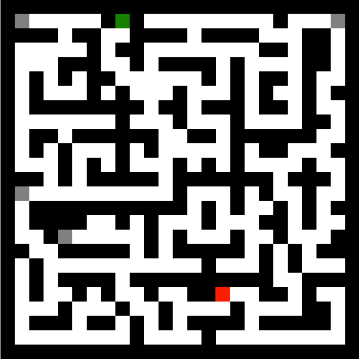
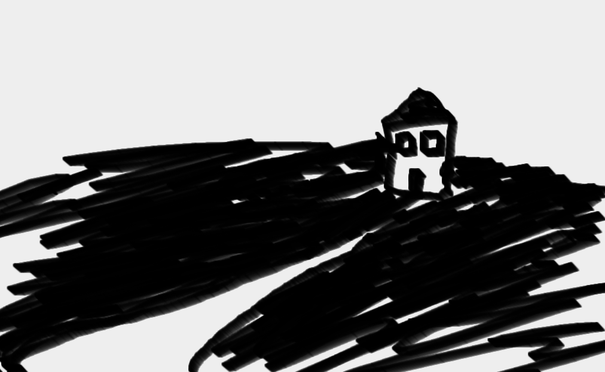

#Zetamaze

##What is it?

Zetamaze is a collaborative web game that allows visitors to edit, add to, and explore a 3D digital maze. Once the game is released it will live and grow on the web driven by the creative actions and decisions of those who participate by visiting the site.

##The Maze

From the site, visitors will be able to both edit and/or play the maze. 

The 3D maze consists of the following

1. 1 Start point (green icon)
2. 1 End point (red icon)
3. 5 hidden items (grey icons)

The maze grid system is made up of 25x25 cube walls. Each side of the walls are covered with black and white digital marker drawings. Each drawing may overlap previous drawings and is not confined to a single wall/cube, but rather can span the length of multiple walls. 

####2D birds-eye-view example maze

####Example drawing

##Gameplay & Objectives

The player's main objective is to reach the treasure at the end of the 3D maze. Additionally, there are five items that the player may find along the way. The player is encouraged to use the drawings on the walls to help orient themselves in the maze as well as remember what areas they have been.

Each item that the player can acquire during gameplay prompts the player to download a file to their hard drive. These files are uploaded by visitors to the Zetamaze site who choose to edit the maze.

The "treasure" at the end of the maze prompts the player to download a .zip file containing the files that the 25 players who most recently completed the maze chose to upload. The player is then prompted to upload their own file that will then be included in the treasure .zip for when other players beat the game. 

##Editing

All edits to the maze effect the maze for all players internationally. 

Zetamaze visitors are encouraged to permanently edit the current state of the maze. All changes that are made to the state of the maze remain in effect until they are overwritten by another editor. Whenever a player loads the maze for gameplay they load the current state of the maze as it exists since the last edit.

Editors have control over:

1. The on/off state of each wall cube (a.k.a. the formation of the walls)
2. The start point of the maze
3. The end point of the maze
4. The location of each of the 5 items
5. The files that each of the 5 items prompt for download
6. The addition of drawings to each wall

Editors do not have the power to erase old drawings, however, they may draw over them with white or black ink.